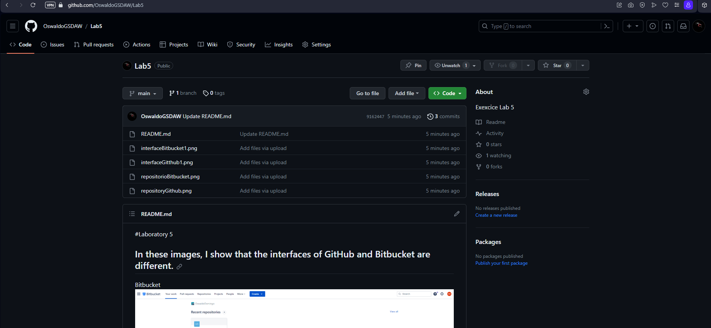

#Laboratory 5
## In these images, I show that the interfaces of GitHub and Bitbucket are different.

[Bitbucket repository public](https://bitbucket.org/oswaldodomingo/holamundo/src/main/)

[Guithub  repository public](https://github.com/OswaldoGSDAW/Lab5)

## The way repositories are displayed is different.
[Bitbucket  repository public](https://bitbucket.org/oswaldodomingo/holamundo/src/main/)

[Guithub  repository public](https://github.com/OswaldoGSDAW/Lab5)

## What I didn't know

**Property and Costs:** GitHub is owned by Microsoft, while Bitbucket is owned by Atlassian. GitHub offers a free plan for public repositories, whereas Bitbucket offers free private repositories for small teams.

**Project Management Features:** GitHub offers tools like Projects and Issues for project management and issue tracking. Bitbucket also has similar features, but GitHub is more renowned for these tools.
